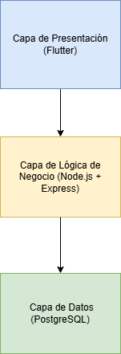
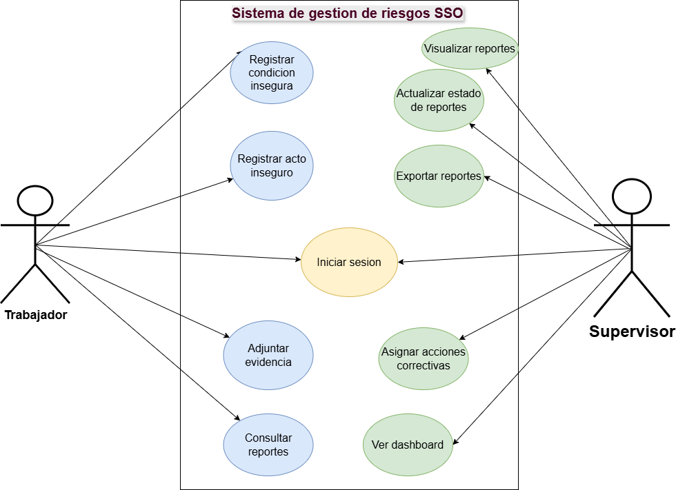
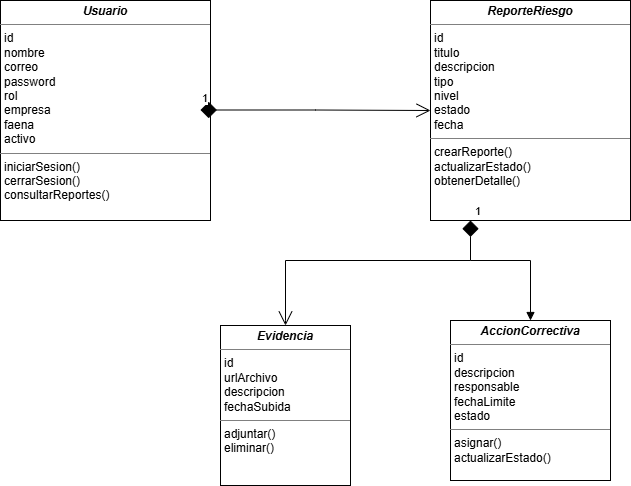

# Sistema de Gestión de riesgos en faenas

**Descripción del proyecto**

El proyecto consiste en la creación de un sistema  integral para la gestión de riesgos faenas. Para contextualizar, existen muchos entornos de trabajo en que los trabajadores están expuestos a riesgos que puedan dañar su integridad, generalmente riesgos físicos. Pueden ser varios escenarios, como inundaciones, cortes de luz, incendios, derrame de químicos, incluso asaltos. Para poder registrar estos incidentes, lo que hace el trabajador que trabaja en esos entornos es registrar los hechos a mano. Es decir, los reportes que ellos elaboran lo realizan a papel, ya sea en blanco o con un formato de reporte otorgado por la empresa. Una vez hecho el reporte, el trabajador debe enviarlo a su correspondiente supervisor (presencialmente) para que éste pueda analizar el caso y resolverlo. 
¿Cuál es el problema con esto? Que todo este proceso consume tiempo, requiere logística y que la trazabilidad no es del todo seguro. Asimismo, el proceso descrito depende de objetos fisicos como los registros en papel, y no hay una base de datos que albergue dichos registros, y a la vez, consultar, actualizar, seleccionar o eliminar. Al haber dependencia de objetos físicos, ello requiere salvaguardarlos de una forma más engorrosa, y al acumularse con el tiempo, resulta más dificil consultar en un futuro un determinado reporte.

**Solución propuesta**

La solución propuesta consiste en digitalizar los procesos que hemos señalado anteriormente. Para ello, queremos elaborar una plataforma tecnológica que permita una comunicación más eficaz y rápida entre los actores señalados que son el trabajador y el supervisor. La plataforma está compuesta por una aplicacion movil (utilizada por los trabajadores) y una aplicacion web (utilizada por los supervisores), cada una diseñada con sus respectivas interfaces. Para permitir una comunicación entre estas aplicaciones, usaremos una arquitectura de microservicio (API). 
Las funcionalidades de estas interfaces las señalaremos a continuacion para cada aplicación:

1) App móvil: la app movil permitirá al trabajador registrar evidencias. Podrá subir tanto imagenes como texto (ya que usaremos una base de datos no estructurada como firebase). Asimismo, el trabajador podrá iniciar sesión, determinar el nivel de gravedad de un incidente antes de enviar la evidencia, podrá hacer seguimiento de su situación en tiempo real (si está pendiente, o finalizado, cuyo estado dependerá del supervisor).
  
2) App Web: la app web permitirá al supervisor visualizar un dashboard de los reportes que ha recibido a lo largo del tiempo. En dicho dashboard puede ver un mapa de calor en el que cada área coloreada representa un incidente reportado y enviado por parte de un trabajador. También podrá actualizar el estado de un reporte, siendo notificada al trabajador instantaneamente. El supervisor también puede registrarse e iniciar sesión en la app web.

Asimismo, disponemos de un wireframe para ambas aplicaciones, siguiendo el diseño visual propuesto por Alloxentric.

**Beneficios de implementar un sistema digitalizado de gestión de riesgos en faenas**

1) permite a la empresa ahorrar gastos al reducir el tiempo en este proceso. 
2) permite una comunicación más eficaz y rápida entre los actores señalados que son el trabajador y el supervisor. 

## Características Principales

- **Reporte de Peligros de Seguridad**: Los trabajadores pueden reportar actos inseguros y condiciones inseguras mediante fotografías, ubicación geográfica y descripciones detalladas.

- **Seguimiento de Estado en Tiempo Real**: Permite monitorear el estado de un reporte durante todo su ciclo de vida (enviado → en revisión → acción asignada → cerrado).

- **Monitoreo de cumplimiento de plazos**: Indicadores visuales que muestran si los reportes están dentro del plazo, en riesgo de incumplimiento o vencidos.

- **Estadísticas Personales de Seguridad**: Permite visualizar tasas de efectividad, rachas de participación y métricas relacionadas con el reporte de Incidentes y Actos Peligrosos (IAP).

- **Notificaciones**: Los usuarios reciben alertas en tiempo real sobre cambios en el estado de sus reportes y avisos de seguridad específicos de su área de trabajo.

- **Soporte Offline**: Los reportes se almacenan localmente cuando no hay conexión a Internet y se sincronizan automáticamente una vez que se restablece la conectividad.

### Funcionalidades Adicionales

- **Medidas de mitigación**: Permite asignar, monitorear y dar seguimiento a acciones correctivas, incluyendo fechas límite y estado de cumplimiento.
- **Comentar y Discutir**: Facilita la colaboración entre los miembros del equipo mediante comentarios asociados a cada reporte.
- **Clasificar los reportes**: Los reportes pueden clasificarse como actos inseguros o condiciones inseguras para mejorar su análisis y tratamiento.
- **Soporte para Múltiples Turnos**: Permite registrar incidentes y observaciones correspondientes a turnos de mañana, tarde o noche.
- **Modo oscuro**: Interfaz diseñada específicamente con una temática oscura y acentos en color naranja de seguridad, optimizando la visibilidad y la experiencia de uso en entornos industriales.

## Stack Tecnológico

### Backend

- 
El backend del Sistema Integral de Gestión de Riesgos (SSO) constituye el núcleo operativo de la plataforma, siendo responsable de procesar la información proveniente de las aplicaciones web y móviles, ejecutar la lógica de negocio, gestionar la seguridad del sistema y coordinar el almacenamiento de datos y archivos. La arquitectura implementada se basa en un modelo de microservicios desplegados sobre infraestructura cloud, lo que permite alcanzar altos niveles de escalabilidad, disponibilidad y mantenibilidad.

### Frontend (Página web)

El frontend del Sistema Integral de Gestión de Riesgos (SSO) constituye la capa de interacción entre los usuarios y la plataforma, proporcionando interfaces especializadas para distintos perfiles operativos y administrativos. La arquitectura frontend fue diseñada bajo un enfoque multiplataforma, compuesto por una aplicación web orientada a la gestión y supervisión, y una aplicación móvil destinada al personal operativo en terreno. Ambas aplicaciones comparten principios de diseño, contratos de API y mecanismos de autenticación, permitiendo mantener coherencia funcional y facilitar la evolución del sistema.

### Frontend (App móvil)
 

### Base de Datos
- Para este proyecto usamos Cloud Firestore como sistema de gestión de bases de datos. Firestore es una base de datos NoSQL, encargada de almacenar datos no estructurados (como contenido multimedia, imágenes) que forma parte del ecosistema de Google Cloud Platform (GCP). Hemos escogido Firestore debido a su escalabilidad y su capacidad de almacenamiento para los reportes, además de que nuestro proyecto es un SaaS (software como un servicio).

Una de las principales ventajas de Firestore es su capacidad de escalamiento horizontal automático. El escalamiento horizontal automático de Firestore significa que, si la aplicación crece y comienzan a utilizarla muchas más empresas y usuarios, Google aumenta la capacidad necesaria detrás de escena sin que nosotros tengamos que preocuparnos por administrar servidores adicionales.

Adicionalmente, Firestore ofrece integración nativa con servicios de Google Cloud, simplificando los mecanismos de autenticación y autorización mediante cuentas de servicio utilizadas por los microservicios desplegados en Cloud Run. Asimismo, dispone de soporte para operaciones asíncronas a través del SDK oficial de Python, facilitando su integración con servicios desarrollados en FastAPI y ejecutados mediante Uvicorn.

La plataforma también incorpora capacidades de sincronización en tiempo real mediante listeners, permitiendo que los cambios en los reportes, alertas o acciones correctivas se reflejen instantáneamente en las interfaces de usuario sin necesidad de consultas periódicas al servidor.

## Modelos de Datos

La estructura de Firestore se organiza utilizando un esquema jerárquico basado en colecciones y subcolecciones. En el nivel superior se encuentra la colección clients, donde cada documento representa una organización cliente del sistema. Este enfoque permite implementar un modelo multi-tenant, asegurando la separación lógica de los datos entre distintas empresas.

Dentro de cada cliente se almacenan diversas subcolecciones que representan las entidades funcionales del sistema:

- users: contiene la información de los usuarios registrados, incluyendo nombre, correo electrónico, rol, áreas asignadas y estado.
- zones: almacena información de las zonas o áreas de trabajo, incluyendo procesos asociados, colores de visualización y coordenadas utilizadas para representar polígonos en mapas de planta.
- reports: registra los reportes de riesgos, actos inseguros, condiciones inseguras e IAP, junto con información sobre responsables, fotografías, turnos y estado del reporte.
- report_events: mantiene un historial completo de cambios de estado, implementando un enfoque de auditoría basado en eventos.
- actions: almacena las acciones correctivas derivadas de los reportes, incluyendo responsables, fechas de vencimiento y estado de cumplimiento.
- comments: permite registrar conversaciones y comentarios asociados a cada reporte.
- alerts: administra las notificaciones y alertas generadas por el sistema.
- exports: conserva el historial de exportaciones de información y reportes generados por los usuarios.

Este diseño favorece la organización lógica de los datos, reduce la complejidad de las consultas y facilita la escalabilidad de la plataforma.

## Seguridad

La arquitectura propuesta incorpora un conjunto de controles de seguridad diseñados para proteger la confidencialidad, integridad y disponibilidad de la información gestionada por el sistema. Estos controles se aplican tanto a nivel de infraestructura como de aplicación, siguiendo buenas prácticas recomendadas para entornos cloud y arquitecturas basadas en microservicios.

**Seguridad en las Comunicaciones**

Todo el tráfico entre clientes, servicios y componentes de la plataforma se realiza mediante el protocolo HTTPS utilizando TLS 1.3. Esta configuración garantiza que la información transmitida viaje cifrada y protegida frente a interceptaciones o ataques de tipo "man-in-the-middle". Adicionalmente, la infraestructura impide conexiones HTTP en entornos de producción, asegurando que todas las comunicaciones utilicen canales seguros.

**Autenticación entre Servicios**

Los distintos microservicios de la plataforma se autentican mediante Service Accounts administradas por Google Cloud Platform. Para ello se utiliza Workload Identity Federation, mecanismo que permite validar la identidad de los servicios sin necesidad de almacenar credenciales o contraseñas dentro del código fuente. Esta estrategia reduce significativamente la superficie de ataque asociada a la gestión de secretos.

**Principio de Mínimos Privilegios**

Cada componente del sistema dispone únicamente de los permisos estrictamente necesarios para ejecutar sus funciones. Este enfoque limita el impacto potencial de una vulnerabilidad o acceso no autorizado. Por ejemplo, los servicios encargados de generar exportaciones son los únicos que poseen permisos de escritura sobre los repositorios de almacenamiento destinados a reportes y documentos.

**Validación de Entradas**

Toda la información ingresada por los usuarios es validada antes de ser procesada por la lógica de negocio. Para ello se emplean modelos de validación definidos mediante Pydantic, verificando tipos de datos, formatos y restricciones de contenido. Esta medida ayuda a prevenir errores de procesamiento, inconsistencias de datos y diversos tipos de ataques basados en entradas maliciosas.

**Auditoría y Trazabilidad**

El sistema mantiene registros estructurados de las acciones realizadas por los usuarios y servicios. Operaciones como creación, modificación, actualización de estados y asignación de acciones correctivas generan eventos de auditoría que incluyen información como identificador de usuario, organización cliente, fecha, hora, acción ejecutada y resultado obtenido. Estos registros permiten realizar análisis posteriores, investigaciones y procesos de cumplimiento normativo.

**Control de Acceso mediante CORS**

La API implementa políticas CORS (Cross-Origin Resource Sharing) para restringir el acceso únicamente a los dominios autorizados del frontend web y la aplicación móvil. En ambientes de desarrollo se permite el acceso desde localhost para facilitar las pruebas, mientras que en producción se aplican restricciones más estrictas para evitar solicitudes provenientes de orígenes no autorizados.

**Protección contra Abuso y Sobrecarga**

La plataforma incorpora mecanismos de limitación de solicitudes (Rate Limiting) para reducir riesgos asociados a ataques de fuerza bruta, automatización maliciosa y consumo excesivo de recursos. Se establecen límites por dirección IP y se aplican controles más estrictos en operaciones sensibles, como los procesos de autenticación.

**Protección de Datos Sensibles**

Las evidencias fotográficas asociadas a incidentes y reportes se consideran información sensible y no se exponen públicamente. El acceso a estos recursos se realiza mediante URLs firmadas generadas dinámicamente por el backend, con tiempos de expiración limitados. De esta manera se garantiza que únicamente usuarios autorizados puedan visualizar el contenido durante un período controlado.

**Beneficios de la Estrategia de Seguridad**

La combinación de cifrado de comunicaciones, autenticación basada en identidades de servicio, validación de datos, auditoría centralizada y control granular de permisos permite construir una plataforma alineada con las buenas prácticas de seguridad modernas. Esta estrategia contribuye a proteger la información operacional de las organizaciones, asegurar la trazabilidad de las acciones realizadas y reducir los riesgos asociados a accesos no autorizados o manipulaciones de datos.

## Integrantes

**CAPSTONE_001D - Grupo 1**

- Sean Parker
- Tomás Figueroa
- Cristóbal Zapata

## Documentación Adicional

- [Carta Gantt](https://docs.google.com/spreadsheets/d/1WdQG8cgWP_Q8y35ntlekh_Nq8pTK4AdS/edit?gid=1137986524#gid=1137986524)

## Arquitectura

La solución propuesta corresponde a una arquitectura distribuida de múltiples capas orientada a servicios, diseñada para soportar la gestión de riesgos e incidentes de Seguridad y Salud Ocupacional (SSO). La arquitectura se basa en una separación clara entre la capa de presentación, la capa de servicios de negocio y la capa de datos, permitiendo escalabilidad, mantenibilidad y facilidad de integración con futuros sistemas.

La capa de presentación está compuesta por aplicaciones cliente web y móvil, desarrolladas para permitir el acceso al sistema desde distintos dispositivos. Estas aplicaciones consumen funcionalidades a través de APIs expuestas por los servicios backend.

La capa de servicios implementa una arquitectura de microservicios, donde cada servicio posee responsabilidades específicas y se comunica mediante interfaces REST. Este enfoque favorece el desacoplamiento funcional, la independencia de despliegue y la escalabilidad de cada componente.

Finalmente, la capa de datos utiliza una base de datos NoSQL basada en Cloud Firestore para el almacenamiento de información operacional y Cloud Storage para la gestión de archivos binarios, tales como fotografías, planos y documentos adjuntos.

La autenticación y autorización son delegadas a un proveedor de identidad externo mediante Keycloak, permitiendo una administración centralizada de usuarios, roles y permisos.

**Beneficios de la Arquitectura Propuesta**
La arquitectura planteada proporciona múltiples beneficios para la organización:
- Escalabilidad horizontal de los servicios.
- Alta disponibilidad de la plataforma.
- Facilidad de mantenimiento y evolución.
- Despliegue independiente de componentes.
- Mayor seguridad mediante autenticación centralizada.
- Trazabilidad completa de eventos e incidentes.
- Integración sencilla con sistemas externos.
- Soporte para crecimiento futuro del número de usuarios y organizaciones.

En conjunto, esta arquitectura permite construir una plataforma robusta, moderna y preparada para soportar las necesidades operacionales de gestión de riesgos e incidentes en entornos industriales y corporativos.
## **Diseño del sistema**

**Diagrama UML**

**Diagrama de clase**

## Metodología ágil basada en Scrum

El proyecto fue desarrollado siguiendo una metodología ágil basada en Scrum, permitiendo la construcción incremental de la solución y la incorporación continua de mejoras a medida que se obtenía retroalimentación sobre el funcionamiento del sistema. Esta metodología favoreció la flexibilidad, la adaptación a cambios en los requerimientos y la validación progresiva de las funcionalidades implementadas.

## Sprint 1: Fundación Arquitectónica e Infraestructura Base

Información General

- Sprint: Sprint 1
- Duración: 3 semanas
- Objetivo del Sprint: Implementar la infraestructura inicial del sistema SSO, configurar la arquitectura de microservicios, establecer los mecanismos de autenticación y desarrollar los componentes fundamentales del frontend y backend.

---

Objetivos del Sprint

Durante este primer sprint, el equipo se enfocará en construir las bases tecnológicas del proyecto, permitiendo que los siguientes sprints se concentren principalmente en el desarrollo funcional. Los objetivos específicos son:

- Configurar el entorno de desarrollo y repositorios.
- Implementar la arquitectura inicial de microservicios.
- Configurar la autenticación mediante Keycloak.
- Desarrollar la estructura base del frontend web y móvil.
- Implementar la conexión con Google Cloud Platform.
- Configurar Firestore y Cloud Storage.
- Establecer el pipeline inicial de integración y despliegue continuo (CI/CD).

---

Actividades Planificadas

Semana 1: Configuración Inicial e Infraestructura

Durante la primera semana se realizarán las actividades orientadas a establecer el entorno tecnológico base:

- Creación y configuración del repositorio Git.
- Definición de la estrategia de ramas utilizando Git Flow simplificado.
- Configuración del entorno de desarrollo local.
- Creación del proyecto en Google Cloud Platform.
- Configuración inicial de Firestore.
- Creación y configuración de buckets en Google Cloud Storage.
- Configuración del entorno de autenticación mediante Keycloak.
- Definición de estándares de codificación y convenciones del proyecto.

Entregables:

- Repositorio principal configurado.
- Proyecto GCP operativo.
- Base de datos Firestore habilitada.
- Buckets de almacenamiento creados.
- Servidor Keycloak funcional.

---

Semana 2: Implementación de Arquitectura Base

Durante la segunda semana se implementará la arquitectura principal del backend y frontend.

Backend

- Creación de la estructura inicial de los siete microservicios:
  - auth-service
  - reports-service
  - incidents-service
  - zones-service
  - alerts-service
  - dashboard-service
  - export-service
- Configuración de FastAPI.
- Implementación de arquitectura por capas:
  - Routers
  - Services
  - Repositories
  - Schemas
- Configuración de Pydantic y validaciones.
- Configuración inicial de Docker.

Frontend Web

- Inicialización del proyecto React + TypeScript.
- Configuración de Tailwind CSS.
- Configuración de Zustand.
- Configuración de TanStack Query.
- Creación del layout principal de la aplicación.

Frontend Móvil

- Inicialización del proyecto React Native.
- Configuración de navegación.
- Configuración de almacenamiento local.
- Creación de pantallas iniciales.

Entregables:

- Arquitectura de microservicios implementada.
- Frontend web inicial funcional.
- Aplicación móvil inicial funcional.
- Contenedores Docker configurados.

---

Semana 3: Autenticación y DevOps

La última semana del sprint estará orientada a seguridad y automatización.

Seguridad

- Integración de Keycloak con backend.
- Validación de tokens JWT.
- Implementación de roles y permisos.
- Configuración de OAuth2/OpenID Connect.

DevOps

- Configuración de Cloud Run.
- Configuración de Cloud Build.
- Implementación del pipeline CI/CD:
  - Lint.
  - Type checking.
  - Testing.
  - Build.
  - Push.
  - Deploy.

Testing

- Configuración de pytest.
- Creación de primeros tests unitarios.
- Configuración de cobertura mínima.

Entregables:

- Sistema de autenticación operativo.
- Pipeline CI/CD funcional.
- Primer despliegue automatizado.
- Suite inicial de pruebas implementada.

Definition of Done (DoD)

El Sprint 1 se considerará finalizado cuando se cumplan los siguientes criterios:

- Los siete microservicios estén creados y desplegados.
- El sistema de autenticación funcione correctamente.
- La aplicación web permita iniciar sesión.
- La aplicación móvil permita autenticación básica.
- Firestore y Cloud Storage se encuentren operativos.
- El pipeline CI/CD ejecute exitosamente el proceso completo.
- La cobertura mínima de pruebas alcance un 80%.
- Toda la documentación técnica inicial haya sido generada.

---

Incremento Entregado

Al finalizar el Sprint 1, el proyecto dispondrá de una plataforma tecnológica completamente operativa, incluyendo infraestructura cloud, arquitectura de microservicios, autenticación centralizada, aplicaciones cliente iniciales y mecanismos automatizados de despliegue, proporcionando una base sólida para el desarrollo funcional de los siguientes sprints.

## Sprint 2: Implementación de Funcionalidades Operacionales

Información General

- Sprint: Sprint 2
- Duración: 3 semanas
- Objetivo del Sprint: Implementar el flujo principal de reportes, la gestión inicial de incidentes, el módulo de zonas y el sistema básico de alertas.

---

Objetivos del Sprint

Durante este segundo sprint, el equipo se enfocará en desarrollar las funcionalidades centrales del sistema, permitiendo registrar incidentes, visualizar información operacional y administrar la estructura espacial de la planta industrial.

Los objetivos específicos son:

- Implementar el sistema de reportes desde la aplicación móvil.
- Desarrollar el módulo de gestión de incidentes.
- Implementar el gemelo digital básico de la planta.
- Construir el sistema inicial de alertas.
- Implementar almacenamiento de archivos e imágenes.
- Desarrollar el sistema de comentarios y eventos.
- Integrar completamente frontend y backend.

---

Actividades Planificadas

Semana 1: Sistema de Reportes

Durante la primera semana se implementará el flujo principal de generación de reportes.

Backend

Se desarrollará el microservicio reports-service, implementando:

- Endpoint de creación de reportes.
- Endpoint de consulta de reportes.
- Validación de permisos de usuario.
- Generación de identificadores únicos.
- Integración con Firestore.
- Registro de eventos asociados.
- Gestión de estados iniciales.

Además, se implementará la integración con Google Cloud Storage para el almacenamiento de fotografías y archivos adjuntos.

Aplicación Móvil

Se desarrollará el flujo completo de reporte:

- Selección del tipo de incidente.
- Captura de fotografía.
- Obtención de geolocalización.
- Selección de área.
- Ingreso de descripción.
- Confirmación de envío.

Asimismo, se implementará el mecanismo de funcionamiento offline mediante almacenamiento local y sincronización automática posterior.

Entregables:

- Creación de reportes operativa.
- Almacenamiento de fotografías funcional.
- Sincronización offline implementada.
- Persistencia en Firestore operativa.

---

Semana 2: Gestión de Incidentes

Durante la segunda semana se desarrollará el módulo principal de gestión de incidentes.

Backend

Se implementará el microservicio incidents-service, incluyendo:

- Creación de incidentes.
- Consulta de incidentes.
- Actualización de estados.
- Gestión de acciones correctivas.
- Registro de eventos históricos.
- Sistema de comentarios.
- Transacciones en Firestore.

Frontend Web

Se desarrollarán las siguientes interfaces:

- Tabla de incidentes.
- Filtros avanzados.
- Vista detallada de incidentes.
- Timeline de eventos.
- Gestión de acciones correctivas.
- Sistema de comentarios.

El sistema implementará trazabilidad completa mediante event sourcing, permitiendo reconstruir el historial completo de cada incidente.

Entregables:

- Gestión de incidentes funcional.
- Timeline de eventos implementado.
- Sistema de comentarios operativo.
- Acciones correctivas habilitadas.

---

Semana 3: Gemelo Digital y Alertas

La tercera semana estará orientada a la visualización espacial y generación de alertas.

Zones Service

Se implementará el microservicio zones-service, incluyendo:

- Creación de zonas.
- Edición de polígonos.
- Carga de planos industriales.
- Asociación de áreas operativas.
- Persistencia de coordenadas.

Frontend Web

Se desarrollará el editor gráfico de zonas mediante:

- Visualización del plano industrial.
- Herramientas de dibujo.
- Edición de polígonos.
- Selección de colores.
- Gestión de capas.

Alerts Service

Se implementará el sistema inicial de alertas:

- Alertas manuales.
- Alertas automáticas.
- Alertas por zonas.
- Alertas por incidentes críticos.
- Gestión de estados de alerta.

Notificaciones

Se integrarán:

- Firebase Cloud Messaging.
- Notificaciones push.
- Actualizaciones en tiempo real.

Entregables:

- Gemelo digital funcional.
- Sistema de alertas operativo.
- Notificaciones push implementadas.
- Gestión espacial de la planta disponible.

---

Definition of Done (DoD)

El Sprint 2 se considerará finalizado cuando:

- Los trabajadores puedan crear reportes desde la aplicación móvil.
- Los supervisores puedan visualizar y gestionar incidentes.
- Las fotografías se almacenen correctamente en Cloud Storage.
- El sistema funcione en modo offline.
- El gemelo digital de la planta permita definir zonas.
- El sistema de alertas genere notificaciones.
- El historial de eventos registre todas las acciones realizadas.
- La integración entre frontend, backend y servicios cloud sea completamente funcional.

---

Incremento Entregado

Al finalizar el Sprint 2, el sistema SSO dispondrá de su núcleo operacional completamente implementado, permitiendo registrar incidentes desde terreno, gestionar eventos de seguridad, administrar zonas industriales y generar alertas automáticas, constituyendo la primera versión funcional integral del producto.

## Sprint 3: Analítica, Visualización y Generación de Reportes

Información General

- Sprint: Sprint 3
- Duración: 3 semanas
- Objetivo del Sprint: Implementar los módulos de visualización analítica, dashboards ejecutivos, mapas de calor, métricas de riesgo y generación de reportes exportables.

---

Objetivos del Sprint

Durante este tercer sprint, el equipo se enfocará en transformar la información operacional generada durante los sprints anteriores en conocimiento útil para la toma de decisiones.

Los objetivos específicos son:

- Implementar dashboards ejecutivos.
- Desarrollar el sistema de indicadores clave de desempeño (KPIs).
- Construir mapas de calor y visualizaciones espaciales.
- Implementar métricas y tendencias de riesgo.
- Desarrollar el sistema de exportación de reportes.
- Optimizar consultas y mecanismos de caché.
- Incorporar herramientas avanzadas de monitoreo y observabilidad.

---

Actividades Planificadas

Semana 1: Dashboard e Indicadores

Durante la primera semana se desarrollará el sistema principal de visualización y análisis.

Backend

Se implementará el microservicio dashboard-service, incorporando:

- Cálculo de KPIs.
- Estadísticas por período.
- Indicadores por zona.
- Indicadores por área operativa.
- Métricas de incidentes críticos.
- Tendencias históricas.
- Cálculo de tasas de riesgo.
- Implementación de caché temporal.

Asimismo, se desarrollarán mecanismos de agregación y procesamiento de datos provenientes de Firestore.

Frontend Web

Se desarrollarán los componentes visuales del dashboard:

- Tarjetas KPI.
- Gráficos estadísticos.
- Panel ejecutivo principal.
- Indicadores comparativos.
- Filtros temporales.
- Paneles de resumen.

Los dashboards permitirán visualizar información operacional consolidada en tiempo real.

Entregables:

- Dashboard principal funcional.
- KPIs implementados.
- Estadísticas operacionales disponibles.
- Sistema de caché operativo.

---

Semana 2: Mapas de Calor y Analítica Espacial

Durante la segunda semana se implementarán las herramientas avanzadas de visualización espacial.

Backend

Se desarrollarán los algoritmos necesarios para:

- Cálculo de densidad de incidentes.
- Agrupación espacial.
- Ponderación de riesgos.
- Clasificación de zonas críticas.
- Generación de datos para heatmaps.

Frontend Web

Se implementará la visualización del gemelo digital enriquecido mediante:

- Heatmaps dinámicos.
- Gradientes de riesgo.
- Visualización por capas.
- Filtros espaciales.
- Filtros temporales.
- Representación gráfica de tendencias.

El sistema permitirá identificar visualmente las áreas con mayor concentración de incidentes y riesgo operacional.

Analítica

Se desarrollarán indicadores como:

- Tasa de incidentes por área.
- Frecuencia de eventos.
- Severidad acumulada.
- Tiempo promedio de resolución.
- Evolución temporal del riesgo.
- Distribución espacial de eventos.

Entregables:

- Sistema de heatmaps operativo.
- Analítica espacial implementada.
- Métricas avanzadas disponibles.
- Visualización interactiva funcional.

---

Semana 3: Exportaciones y Observabilidad

La tercera semana estará orientada a generación documental y monitoreo del sistema.

Export Service

Se implementará el microservicio export-service, incorporando:

- Exportación PDF.
- Exportación XLSX.
- Exportación CSV.
- Generación asíncrona de reportes.
- Almacenamiento temporal.
- Descarga segura mediante URLs firmadas.

Los reportes incluirán:

- Indicadores.
- Gráficos.
- Estadísticas.
- Historial de incidentes.
- Mapas de calor.
- Resúmenes ejecutivos.

Observabilidad y Monitoreo

Se implementarán herramientas de monitoreo para:

- Logging estructurado.
- Métricas operacionales.
- Trazabilidad distribuida.
- Monitoreo de microservicios.
- Seguimiento de errores.
- Auditoría de usuarios.

Optimización

Se realizarán actividades de optimización orientadas a:

- Reducción de latencia.
- Optimización de consultas.
- Implementación de índices.
- Configuración de cachés.
- Ajustes de escalabilidad automática.

Entregables:

- Sistema de exportaciones funcional.
- Reportes PDF y Excel operativos.
- Plataforma de monitoreo implementada.
- Sistema optimizado para producción.

---

Definition of Done (DoD)

El Sprint 3 se considerará finalizado cuando:

- Los dashboards presenten información en tiempo real.
- Los KPIs sean calculados correctamente.
- Los mapas de calor funcionen sobre el gemelo digital.
- Las métricas de riesgo estén disponibles.
- Los reportes PDF y XLSX puedan generarse exitosamente.
- El sistema de monitoreo registre eventos y errores.
- Las consultas críticas se encuentren optimizadas.
- La plataforma soporte la carga operacional esperada.

---

Incremento Entregado

Al finalizar el Sprint 3, el sistema SSO dispondrá de capacidades avanzadas de análisis y apoyo a la toma de decisiones, permitiendo transformar datos operacionales en información estratégica mediante dashboards ejecutivos, mapas de calor, indicadores de riesgo y generación automatizada de reportes, consolidando la plataforma como una herramienta integral de gestión de riesgos industriales.

## Sprint 4: Optimización, Seguridad y Despliegue Productivo

Información General

- Sprint: Sprint 4
- Duración: 3 semanas
- Objetivo del Sprint: Realizar la validación integral del sistema, optimizar el rendimiento, fortalecer la seguridad, completar la documentación y preparar el despliegue productivo de la plataforma SSO.

---

Objetivos del Sprint

Durante este cuarto sprint, el equipo se enfocará en asegurar la estabilidad, seguridad y mantenibilidad del sistema antes de su puesta en producción.

Los objetivos específicos son:

- Implementar pruebas integrales del sistema.
- Fortalecer los mecanismos de seguridad.
- Optimizar el rendimiento de backend y frontend.
- Completar la observabilidad y auditoría.
- Generar documentación técnica y de usuario.
- Realizar pruebas de aceptación.
- Preparar el despliegue en producción.

---

Actividades Planificadas

Semana 1: Testing Integral y Validación

Durante la primera semana se ejecutará el proceso completo de aseguramiento de calidad.

Testing Backend

Se implementarán y ejecutarán:

- Tests unitarios.
- Tests de integración.
- Tests de endpoints REST.
- Tests de autenticación.
- Tests de permisos y roles.
- Tests de almacenamiento.
- Tests de exportación.

Asimismo, se verificará el cumplimiento del objetivo mínimo de cobertura de código establecido para el proyecto.

Testing Frontend

Se realizarán pruebas sobre:

- Navegación.
- Formularios.
- Validaciones.
- Flujos de usuario.
- Manejo de errores.
- Integración con backend.

Testing Funcional

Se desarrollarán escenarios de prueba para validar:

- Registro de incidentes.
- Gestión de alertas.
- Administración de zonas.
- Generación de dashboards.
- Exportación de reportes.
- Funcionamiento offline.

Entregables:

- Suite completa de pruebas ejecutada.
- Reportes de cobertura generados.
- Corrección de defectos críticos.
- Validación funcional completa.

---

Semana 2: Seguridad y Optimización

Durante la segunda semana se ejecutarán actividades orientadas al hardening del sistema.

Seguridad

Se implementarán y verificarán:

- Validación exhaustiva de entradas.
- Restricciones CORS.
- Control de acceso basado en roles.
- Protección mediante HTTPS/TLS.
- Gestión segura de credenciales.
- Validación de permisos entre microservicios.
- Auditoría de operaciones.
- Generación de URLs firmadas para archivos privados.

Además, se realizarán pruebas orientadas a detectar:

- Accesos no autorizados.
- Errores de autenticación.
- Escalamiento indebido de privilegios.
- Exposición de datos sensibles.

Optimización Backend

Se realizarán actividades de optimización sobre:

- Consultas Firestore.
- Índices compuestos.
- Estrategias de caché.
- Escalamiento automático.
- Consumo de memoria.
- Tiempo de respuesta.

Optimización Frontend

Se optimizarán:

- Renderizado de componentes.
- Gestión de estado.
- Carga diferida.
- Caché local.
- Tamaño de bundles.
- Experiencia móvil.

Entregables:

- Auditoría de seguridad aprobada.
- Sistema optimizado.
- Rendimiento validado.
- Reducción de latencia operativa.

---

Semana 3: Documentación y Despliegue Productivo

La última semana del proyecto estará orientada a la preparación de la entrega final.

Documentación Técnica

Se elaborará la documentación correspondiente a:

- Arquitectura general del sistema.
- Arquitectura backend.
- Arquitectura frontend.
- Modelo de datos.
- APIs REST.
- Infraestructura cloud.
- Configuración de despliegue.
- Manual de mantenimiento.

Documentación de Usuario

Se desarrollarán:

- Manual del trabajador.
- Manual del supervisor.
- Manual del administrador.
- Guías operacionales.
- Procedimientos de recuperación.

DevOps y Producción

Se realizará:

- Configuración del entorno productivo.
- Configuración de dominios.
- Configuración de certificados.
- Configuración de monitoreo.
- Configuración de alertas.
- Despliegue final en Cloud Run.
- Validación post-despliegue.

Cierre del Proyecto

Se ejecutarán las siguientes actividades:

- Sprint Review.
- Sprint Retrospective.
- Entrega de documentación.
- Capacitación inicial.
- Presentación final del sistema.

Entregables:

- Documentación completa.
- Sistema desplegado en producción.
- Manuales de usuario.
- Monitoreo operativo.
- Entrega final del proyecto.

---

Definition of Done (DoD)

El Sprint 4 se considerará finalizado cuando:

- La cobertura de pruebas alcance el objetivo establecido.
- No existan defectos críticos abiertos.
- Las auditorías de seguridad hayan sido aprobadas.
- El rendimiento cumpla los requisitos definidos.
- La documentación técnica esté completa.
- Los manuales de usuario hayan sido elaborados.
- El sistema se encuentre desplegado en producción.
- El monitoreo y observabilidad estén operativos.
- Los usuarios clave hayan validado el funcionamiento del sistema.

---

Incremento Entregado

Al finalizar el Sprint 4, el sistema SSO dispondrá de una plataforma completamente funcional, segura, optimizada y preparada para operación productiva. El proyecto contará con infraestructura cloud desplegada, arquitectura de microservicios operativa, aplicaciones web y móvil funcionales, capacidades analíticas avanzadas, mecanismos de seguridad robustos y documentación integral, permitiendo su utilización en entornos industriales reales.

## Licencia

Este proyecto fue desarrollado como parte del proyecto APT (Aplicación de Proyecto Tecnológico) para Alloxentric.

**Versión**: 1.0
**Última actualización**: 01-07-2026
